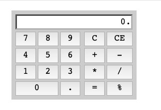

# Restate

Another way to express the control state in user interfaces.

Not much here, yet.
https://asolove.medium.com/pure-ui-control-ac8d1be97a8d
https://rauchg.com/2015/pure-ui

# Deploying

[Skip Build Step](https://vercel.com/docs/build-step)

Some static projects do not require building. An example of this would be a website with only HTML/CSS/JS source files that can be served as-is (For example, you might just have a single index.html file).

In such cases, you should:

    Specify "Other" as the framework preset, and
    Enable the Override option for the Build Command, and
    Leave the Build Command empty.

This will prevent the build from being attempted and serve your content as-is.
